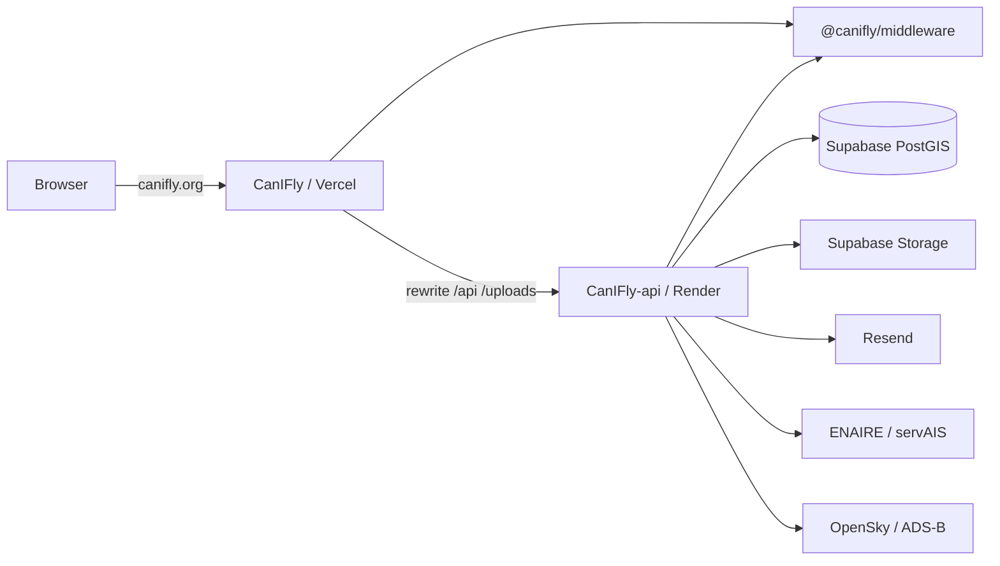

# CanIFly

**[canifly.org](https://canifly.org)** — one-tap UAS airspace status for Spain. Tap the map and get **Clear / Limited / Restricted / Prohibited**, filtered by your drone class and planned altitude (Open category).

Spanish is the default language; English is at [`/en`](https://canifly.org/en). CanIFly is **not** an official ENAIRE or AESA product — always cross-check official sources before flying.

---

## Live links

| | URL |
|--|-----|
| **Website** | [https://canifly.org](https://canifly.org) |
| **English** | [https://canifly.org/en](https://canifly.org/en) |
| **API health** | [https://canifly-api.onrender.com/health](https://canifly-api.onrender.com/health) |
| **Guide** | [https://canifly.org/guide](https://canifly.org/guide) |
| **FAQ** | [https://canifly.org/faq](https://canifly.org/faq) |

---

## What the app does

| Capability | Description |
|------------|-------------|
| **Airspace status** | Click any point in Spain; API evaluates overlapping UAS zones against your profile and returns a single status + matched zones |
| **Zone map layers** | Pink ZGUAS-style fills from aero / urbano / infra (and related) sources, filtered by altitude/profile |
| **Drone profile** | Weight class (e.g. C0–C2) and AGL altitude drive Open-category ceilings and which zones apply |
| **Community obstacles & fly spots** | Report obstacles or places to fly; photo upload; ▲/▼ votes; inactive when dislikes dominate |
| **Live traffic** | Aircraft overlay (OpenSky when reachable; community ADS-B fallback when cloud hosts are blocked) |
| **Weather** | Point weather for the selected location |
| **Accounts** | Register → email verification → login; profile (avatar, bio, operator number); public pilot pages |
| **Settings** | Language (ES/EN, saved on the account when signed in) and theme (light / dark / system) |
| **i18n & SEO** | Spanish default + English; sitemap, OG image, JSON-LD |

---

## Production infrastructure

Cheap go-live stack — typically **€0–12/yr** (domain) plus free tiers elsewhere. Render free tier **sleeps** after idle (cold starts on the API).

| Piece | Provider | Role | Live / notes |
|-------|----------|------|----------------|
| **Web** | [Vercel](https://vercel.com) (Hobby) | Next.js UI, i18n, map | [canifly.org](https://canifly.org) — auto-deploys from `main` |
| **API** | [Render](https://render.com) (Docker) | Hono + auth, zones, obstacles, traffic proxy | [canifly-api.onrender.com](https://canifly-api.onrender.com) |
| **Shared package** | GitHub | Zod schemas, geo, EN/ES labels | [`CanIFly-middleware`](https://github.com/EugeneKrokhmal/CanIFly-middleware) (`dist/` on `main`) |
| **Database** | [Supabase](https://supabase.com) | Postgres + PostGIS | EU pooler; schema bootstrap on API boot |
| **Photos** | Supabase Storage | Obstacle & avatar uploads | Bucket `canifly-uploads` (durable across Render redeploys) |
| **Email** | [Resend](https://resend.com) | Verification mail (ES/EN) | Links use `APP_URL=https://canifly.org` |
| **Domain / DNS** | [Cloudflare](https://www.cloudflare.com) | Registrar + DNS → Vercel | `canifly.org` |
| **Map tiles** | [OpenFreeMap](https://openfreemap.org) | Basemap style for MapLibre | `NEXT_PUBLIC_MAP_STYLE` |
| **Airspace data** | ENAIRE / servAIS | UAS zone geometry ingest | Via API |
| **Aircraft** | OpenSky + adsb.lol / airplanes.live | Live traffic | OpenSky optional OAuth; community ADS-B fallback |
| **Weather** | Open-Meteo | Point forecasts | Via API |
| **Drone catalog** | OpenDroneList | Model / class picker | Via API |

### Request path

```
Browser  →  https://canifly.org                 (Vercel / Next.js)
                 │
                 ├── pages, MapLibre UI, i18n, SEO
                 └── /api/*  and  /uploads/*   rewritten to API_URL
                            │
                            ▼
               https://canifly-api.onrender.com  (Render / Docker)
                            │
          ┌─────────────────┼─────────────────┬──────────────┐
          ▼                 ▼                 ▼              ▼
     Supabase PostGIS   Supabase Storage   Resend      Traffic feeds
     (zones, users,     (photos)           (verify)    (OpenSky / ADS-B)
      obstacles)
          │
          └── ENAIRE / servAIS (zone ingest)
```

Auth cookies are set on **canifly.org** because the browser only talks to the site origin; Vercel proxies `/api` to Render.

Full deploy checklist, env vars, and DNS: **[DEPLOY.md](./DEPLOY.md)**.

---

## Repositories

Three siblings under the same parent folder:

```
Sites/GitHub/
├── CanIFly/                 ← this repo — Next.js web (:3000 / Vercel)
├── CanIFly-api/             ← Hono + PostGIS API (:4000 / Render)
└── CanIFly-middleware/      ← shared Zod schemas, geo, EN/ES labels
```

| Package | Repo | Role |
|---------|------|------|
| **CanIFly** | [github.com/EugeneKrokhmal/CanIFly](https://github.com/EugeneKrokhmal/CanIFly) | MapLibre UI, shell, i18n, client state |
| **CanIFly-api** | [github.com/EugeneKrokhmal/CanIFly-api](https://github.com/EugeneKrokhmal/CanIFly-api) | Auth, DB, ingest, obstacles, traffic, weather |
| **@canifly/middleware** | [github.com/EugeneKrokhmal/CanIFly-middleware](https://github.com/EugeneKrokhmal/CanIFly-middleware) | Status classification, request schemas, constants |

**Production:** web installs middleware from GitHub (`github:EugeneKrokhmal/CanIFly-middleware#main` with committed `dist/`).

**Local monorepo:** use `"@canifly/middleware": "file:../CanIFly-middleware"`.



---

## Technical decisions

### Why three packages?

- **Shared geo rules must not drift** — status classification, profile filters, and Zod schemas live once in middleware.
- **Next.js stays a thin UI** — App Router does not own business logic or secrets; it rewrites `/api` and `/uploads` to Hono.
- **API deploys independently** — PostGIS, JWT, uploads, and upstream rate limits stay off the Next process.

### Frontend choices

| Choice | Why |
|--------|-----|
| **Next.js App Router** | Routing, SSR shell, locale segments, rewrites |
| **MapLibre GL** | Open basemap (OpenFreeMap), full control over layers/markers/popups |
| **Zustand** | Light client stores for auth, drone profile, obstacles, theme |
| **next-intl** | `es` default with `localePrefix: "as-needed"`; `en` under `/en` |
| **Same-origin proxy** | Browser always uses `/api/*`; cookies stay simple in local and prod |

### Coordinates & coverage

- Coordinates are **WGS84 (EPSG:4326)**.
- Coverage is Spain (peninsula + islands) via `SPAIN_BOUNDS` in middleware.

---

## Project structure

```
CanIFly/
├── DEPLOY.md                 # production deploy guide
├── messages/                 # es.json, en.json UI strings
├── public/
├── src/
│   ├── app/
│   │   ├── opengraph-image.tsx
│   │   ├── sitemap.ts / robots.ts
│   │   └── [locale]/         # locale-aware pages
│   │       ├── page.tsx      # map home
│   │       ├── account/ | settings/ | verify-email/
│   │       ├── pilots/[id]/ | guide/ | faq/ | privacy/ | contacts/
│   │       └── HomePageClient.tsx
│   ├── components/
│   │   ├── map/              # MapLibre map, layers, popups
│   │   ├── layout/           # header, shell, auth modal
│   │   ├── settings/         # language + theme
│   │   └── sidebar/
│   ├── hooks/                # airspace, zones, obstacles, traffic
│   ├── stores/               # auth, drone-profile, obstacles, theme
│   ├── i18n/
│   ├── lib/                  # seo, map icons, drones, weather
│   └── middleware.ts         # next-intl
├── next.config.ts            # API_URL rewrites + transpilePackages
└── package.json
```

---

## Quick start (local)

Prerequisites: **Node 20+**, sibling `CanIFly-api` and `CanIFly-middleware`, Docker for PostGIS (or a local Supabase URL).

```bash
# 1) Shared package
cd ../CanIFly-middleware && npm install && npm run build

# 2) API + database
cd ../CanIFly-api
cp .env.example .env
npm install
npm run db:up          # or point DATABASE_URL at Supabase
npm run db:migrate
npm run dev            # http://localhost:4000

# 3) Web
cd ../CanIFly
cp .env.example .env
npm install
npm run dev            # http://localhost:3000
```

### Environment (web)

| Variable | Example | Purpose |
|----------|---------|---------|
| `API_URL` | `http://localhost:4000` | Backend for Next rewrites (prod: Render URL) |
| `NEXT_PUBLIC_SITE_URL` | `https://canifly.org` | Canonical origin (sitemap, OG, JSON-LD) |
| `NEXT_PUBLIC_MAP_STYLE` | OpenFreeMap liberty URL | MapLibre style |

Rewrites in `next.config.ts`:

- `/api/:path*` → `$API_URL/api/:path*`
- `/uploads/:path*` → `$API_URL/uploads/:path*`

### Locales

| URL | Locale |
|-----|--------|
| `/`, `/faq`, … | Spanish (`es`, default, no prefix) |
| `/en`, `/en/faq`, … | English |

Language lives under **Settings**; when signed in it is stored on the account and restored on next login.

### Scripts

```bash
npm run dev      # Next + Turbopack
npm run build
npm run start
npm run lint
npm test         # vitest
```

---

## Related docs

- Production deploy: **[DEPLOY.md](./DEPLOY.md)**
- API setup & routes: [`CanIFly-api` README](https://github.com/EugeneKrokhmal/CanIFly-api)
- Schemas & classification: [`CanIFly-middleware` README](https://github.com/EugeneKrokhmal/CanIFly-middleware)

## Disclaimer

Informational tool only. Regulations and zone geometries change. Verify with [ENAIRE](https://www.enaire.es/) / AESA and local NOTAMs before any flight.
