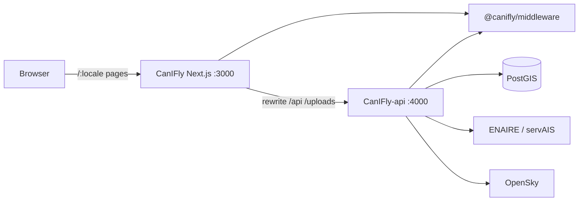

# CanIFly

**One-tap UAS airspace status for Spain** — tap the map and get **Clear / Limited / Restricted / Prohibited**, filtered by your drone class and planned altitude (Open category).

CanIFly is **not** an official ENAIRE or AESA product. Always cross-check with official sources before flying.

---

## What the app does

| Capability | Description |
|------------|-------------|
| **Airspace status** | Click any point in Spain; API evaluates overlapping UAS zones against your profile and returns a single status + matched zones |
| **Zone map layers** | Pink ZGUAS-style fills from aero / urbano / infra (and related) sources, filtered for map readability by altitude/profile |
| **Drone profile** | Weight class (e.g. C0–C4) and AGL altitude drive Open-category ceilings and which zones apply |
| **Community obstacles** | Report construction, cranes, power lines, air sports, other; photo upload; ▲/▼ votes; inactive when dislikes dominate |
| **Live traffic** | Optional OpenSky aircraft overlay + track |
| **Weather** | Point weather widget for the selected location |
| **Accounts** | Register / login (JWT cookie), profile (avatar, bio, operator number), public pilot pages |
| **i18n** | Spanish default + English (`next-intl`) |

---

## Repository layout (three siblings)

CanIFly was split from a monolith into three repos that live side-by-side under the same parent folder:

```
Sites/GitHub/
├── CanIFly/                 ← this repo — Next.js web UI (:3000)
├── CanIFly-api/             ← Hono + PostGIS API (:4000)
└── CanIFly-middleware/      ← shared Zod schemas, geo, EN/ES labels
```

| Package | Role |
|---------|------|
| [`CanIFly`](https://github.com/EugeneKrokhmal/CanIFly) | Browser app: MapLibre map, shell, i18n, client state |
| [`CanIFly-api`](https://github.com/EugeneKrokhmal/CanIFly-api) | Auth, DB, ENAIRE/servAIS ingest & queries, obstacles, traffic proxy |
| [`@canifly/middleware`](https://github.com/EugeneKrokhmal/CanIFly-middleware) | Single source of truth for status classification, request schemas, constants |

Local linking (until published to npm):

```json
"@canifly/middleware": "file:../CanIFly-middleware"
```



---

## Technical decisions

### Why three packages?

- **Shared geo rules must not drift** — status classification (`classifyStatus`), profile filters, and Zod query schemas live once in middleware and are imported by both API and (where useful) the web.
- **Next.js stays a BFF-less UI** — the App Router does not own business logic or secrets; it rewrites `/api` and `/uploads` to the Hono server.
- **API can scale / deploy independently** — PostGIS, JWT, file uploads, and upstream rate limits stay off the Next process.

### Frontend choices

| Choice | Why |
|--------|-----|
| **Next.js 15 App Router** | Routing, SSR shell, easy locale segments, rewrites |
| **MapLibre GL 4.x** | Open basemap (OpenFreeMap), full control over layers/markers/popups |
| **Zustand** | Light client stores for auth, drone profile, obstacles UI |
| **next-intl** | `es` default with `localePrefix: "as-needed"`; `en` under `/en` |
| **Proxy rewrites** | Browser always talks same-origin `/api/*`; cookies and CORS stay simple in local/prod |

### Coordinates & coverage

- All coordinates are **WGS84 (EPSG:4326)**.
- Coverage is Spain (peninsula + islands) via `SPAIN_BOUNDS` in middleware.
- Map style URL: `NEXT_PUBLIC_MAP_STYLE` (default OpenFreeMap bright).

### Status UX

- Clicking the map sets the selected point and opens a **status popup** (no main “takeoff pin” marker).
- Zone list pins (numbered) and pending obstacle-placement markers remain for those flows.

---

## Project structure

```
CanIFly/
├── messages/                 # es.json, en.json UI strings
├── public/                   # static assets
├── src/
│   ├── app/
│   │   ├── layout.tsx        # root HTML shell
│   │   └── [locale]/         # locale-aware pages
│   │       ├── page.tsx      # map home
│   │       ├── account/      # profile
│   │       ├── pilots/[id]/  # public pilot
│   │       ├── faq|privacy|contacts/
│   │       └── HomePageClient.tsx
│   ├── components/
│   │   ├── map/MapView.tsx   # MapLibre map, layers, popups
│   │   ├── layout/           # header, shell, auth modal, mobile sheet
│   │   └── sidebar/          # drone picker, report obstacle, panel
│   ├── hooks/                # airspace status, zones, obstacles, traffic
│   ├── stores/               # zustand: auth, drone-profile, obstacles
│   ├── i18n/                 # routing, request, navigation helpers
│   ├── lib/map|drones|weather/
│   └── middleware.ts         # next-intl middleware
├── next.config.ts            # API_URL rewrites + transpilePackages
└── package.json
```

---

## Quick start

Prerequisites: **Node 20+**, sibling folders `CanIFly-api` and `CanIFly-middleware`, Docker for PostGIS (API).

```bash
# 1) Shared package
cd ../CanIFly-middleware && npm install && npm run build

# 2) API + database
cd ../CanIFly-api
cp .env.example .env
npm install
npm run db:up
npm run db:migrate
npm run dev          # http://localhost:4000

# 3) Web
cd ../CanIFly
cp .env.example .env
npm install
npm run dev          # http://localhost:3000
```

### Environment

| Variable | Default | Purpose |
|----------|---------|---------|
| `API_URL` | `http://localhost:4000` | Backend base for Next rewrites |
| `NEXT_PUBLIC_MAP_STYLE` | OpenFreeMap bright | MapLibre style URL |

Rewrites in `next.config.ts`:

- `/api/:path*` → `$API_URL/api/:path*`
- `/uploads/:path*` → `$API_URL/uploads/:path*`

### Locales

| URL | Locale |
|-----|--------|
| `/`, `/faq`, … | Spanish (`es`, default, no prefix) |
| `/en`, `/en/faq`, … | English |

Toggle **ES \| EN** in the header.

### Scripts

```bash
npm run dev      # Next + Turbopack
npm run build
npm run start
npm run lint
npm test         # vitest
```

---

## Related docs

- API setup, routes, PostGIS: [`CanIFly-api/README.md`](../CanIFly-api/README.md)
- Schemas, classification, labels: [`CanIFly-middleware/README.md`](../CanIFly-middleware/README.md)

## Disclaimer

Informational tool only. Regulations and zone geometries change. Verify with [ENAIRE](https://www.enaire.es/) / AESA and local NOTAMs before any flight.
